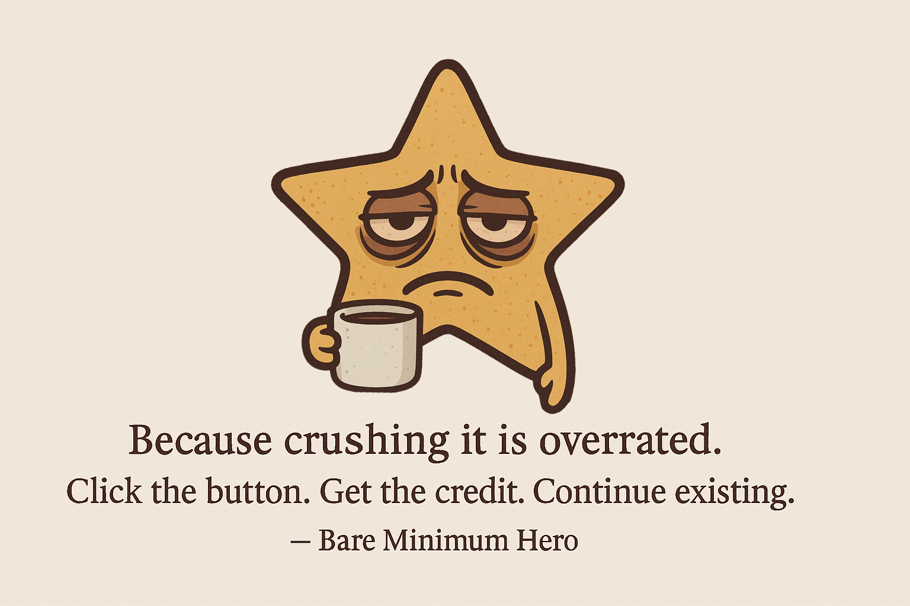

# Bare Minimum Hero

A minimalist Chrome extension that lets users mark micro-achievements for the day and receive ironic praise for it.

## 🚀 Description

"Bare Minimum Hero" is an extension for those who understand that sometimes doing just something is already a win. No complicated habit trackers, productivity graphs, or annoying reminders - just press a button at the end of the day if you've done at least the minimum.

## ✨ Features

- Simple interface with one question and one button
- Ironic, motivational praise messages
- "Hero points" counter to track your consistency
- Daily reminder (which you can ignore)
- No intrusive gamification or guilt

## 🔧 Installation

1. Download or clone this repository
2. Open Chrome and go to the extensions page (chrome://extensions/)
3. Enable "Developer mode" (top right corner)
4. Click "Load unpacked extension"
5. Select the folder with the unpacked extension
6. Done!

## 🖼️ Icons

For full functionality, you need to add icons to the `images/` folder:
- icon16.png (16x16 pixels)
- icon48.png (48x48 pixels)
- icon128.png (128x128 pixels)

You can use any icons that match the required sizes or create your own.

## 📝 TODO before publishing

1. Create icons in the specified sizes
2. Test notification functionality
3. Check extension performance in different time zones
4. Add additional praise phrases if desired

## 🤔 Philosophy

The world is full of apps that make us strive for more. "Bare Minimum Hero" reminds us that sometimes it's worth praising yourself just for surviving today.

---

**Bare Minimum Hero** is a Chrome extension for people who are *not* crushing it, *not* optimizing every second, and *definitely not* building a second brain.  
It's for the real heroes — the ones who **wake up, do one thing, and don't combust.**

## 🚀 What It Does

- ✅ Asks you once a day:  
  > "Did you do the bare minimum today?"
- ✨ You click: **"Yes. Barely."**
- 🎉 It gives you a randomly sarcastic but emotionally validating compliment
- 🧠 It tracks your *hero points* (because you *exist* and that's basically a superpower)
- 🔒 Only once per day. No cheating. This isn't CrossFit.

## 🧾 Why It Exists

Because **life is hard, productivity is overrated**, and sometimes you just need a system that says:  
> "👏 You did one thing. Wow. Incredible. Hero."

No dashboards.  
No tracking software.  
No guilt.

Just one click.  
One moment of dignity.  
One sarcastic round of applause.  
Every day.

## 🧠 Use Cases

- Wrote one email? ✅  
- Cleaned a dish? ✅  
- Didn't cry at work? ✅  
- Resisted urge to start side project at 3am? ✅  
- Stared into abyss but blinked first? ✅

**You're a Bare Minimum Hero. And this extension knows it.**

---

## 📦 Install Instructions

Coming soon to [Chrome Web Store]()  
Or clone & load as an unpacked extension via `chrome://extensions`

---

## 💬 Example Feedback

> "This app made me feel like not-totally-garbage. 10/10."  
> — Literally me

> "Finally, a productivity tool that respects my desire to do nothing but still feel victorious."  
> — Emotionally exhausted but functioning human

---

## 🛠 Dev Status

Current build: `MVP but fabulous`  
To-do:
- More quotes
- Unlockable "achievements"
- Light/dark mode for maximum emotional contrast
- Hidden Nik Mode™ (no compliments, just silence and existential dread)

---

## 🧙‍♂️ Made by

A tired genius with a keyboard.  
Helped by an AI who's probably too emotionally invested in this project.  
Yes, it's ironic.

---

> **Bare Minimum Hero**  
> Because *you showed up*, and that's already impressive.

